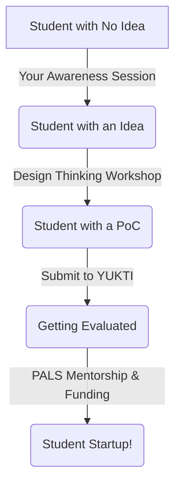

# 🚀 Head of Startup Awareness: The Ultimate Playbook

As the Head of the Startup Awareness Program for the ACE IIC Students Council, you are the face of innovation on campus. Your job isn't to build everyone's startup; your job is to **spark the fire, provide the map, and guide them to the right resources.**

Here is everything you must know to be a successful leader in this role.

---

## 1. Your Core Mission
*   **Inspire:** Make entrepreneurship look cool, accessible, and achievable for regular engineering students.
*   **Educate:** Teach them the basic vocabulary of startups (IPR, MVP, Pitching).
*   **Funnel:** Guide students who have ideas directly to the IIC events and the YUKTI portal.

---

## 2. Key Terms & Platforms You MUST Master

When students ask you questions, you need to know exactly what these mean:

### Platforms
*   **IIC (Institution's Innovation Council):** The campus hub mandated by the Ministry of Education. It organizes the events, bootcamps, and brings in the speakers.
*   **YUKTI (National Innovation Repository - NIR):** The official government portal. **This is your most important tool.** When a student says "I have an idea," your immediate response should be: "Submit it to YUKTI." It's where ideas get evaluated for government funding and incubation.
*   **PALS (Pan IIT Alumni Leadership Series):** An elite network of IIT Alumni. Tell students: *"If you prove you are serious, we will connect you with PALS for top-tier industry mentorship and hackathons."*

### Startup Vocabulary
*   **Ideation:** The process of brainstorming and finding a real-world problem to solve.
*   **PoC (Proof of Concept):** A small test to prove the idea actually works in the real world.
*   **MVP (Minimum Viable Product):** The very first, basic version of a product that you can show to a customer or investor.
*   **IPR (Intellectual Property Rights):** How you protect an idea. Includes **Patents** (for inventions/hardware), **Copyrights** (for code/software), and **Trademarks** (for brand names).
*   **Incubation:** A physical space (usually in the college) where startups get free WiFi, office space, and mentorship to grow.

---

## 3. The Student Innovation Pipeline (Your Map)

When you meet a student, you need to figure out where they are on this map and push them to the next step:

---

## 4. Your Action Plan (What you actually do)

### A. Classroom Pitches (The "Roadshow")
Go to 2nd and 3rd-year classrooms. Give a 5-minute high-energy pitch. 
*   **The Hook:** "Who wants to work for someone else, and who wants to hire people?"
*   **The Solution:** Introduce IIC, YUKTI, and PALS.
*   **The CTA (Call to Action):** Have a QR code ready for them to join a WhatsApp group or register for your next event.

### B. Organizing "Entry-Level" Events
Don't start with complex patent filing workshops. Start with:
*   **Idea-Café Sessions:** Informal meetups where people just talk about problems they want to solve.
*   **Startup Movie Nights:** Watch movies like *The Social Network* or *Silicon Valley* to build hype.
*   **Alumni Success Stories:** Bring back an ACE alumnus who started a company.

### C. Creating Campus Buzz
*   Put up posters of famous Indian student founders (like the founders of Zepto or Oyo). 
*   Use your college social media to highlight students who are building cool mini-projects.

---

## 5. Why Your Role Matters to the College (The 5-Star Rating)

The Ministry of Education ranks colleges out of 5 Stars based on their IIC performance. 

*   **Activity Score (80% weightage):** The college gets points only if students actually attend the events, submit ideas, and participate in hackathons. 
*   If your awareness program is weak, nobody shows up to the events, and the college loses its star rating. 
*   **If you do your job well:** The college gets 5 stars, which attracts better companies for placements, more funding from the government, and makes your resume look incredible.

> [!IMPORTANT]  
> **Your Golden Rule:** Never say "I don't know." If a student asks a complex question about patent filing or funding stages, say: *"That's a great question for the R&D Cell. Let me connect you with Dr. Murali Sir or our IIC President."* You are the bridge, not the entire library!
