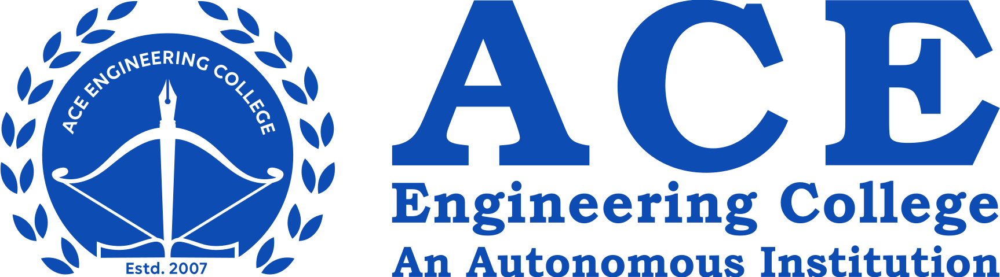
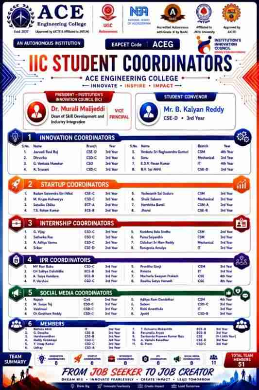
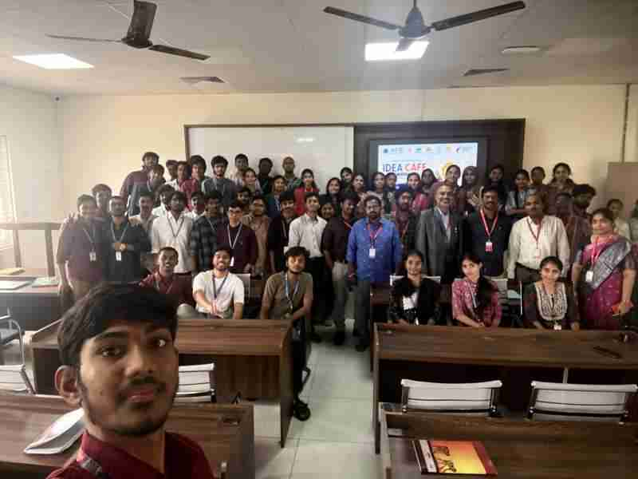
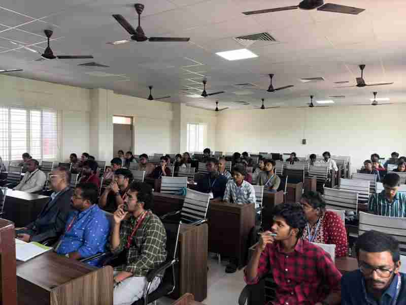
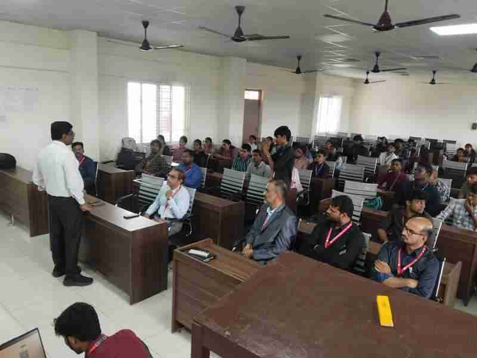
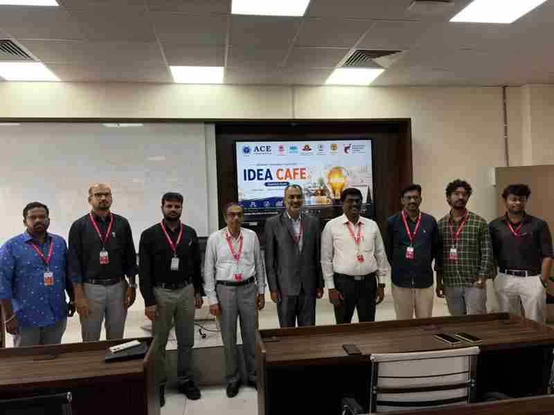
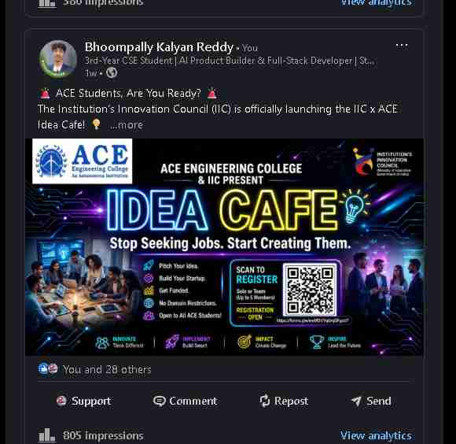
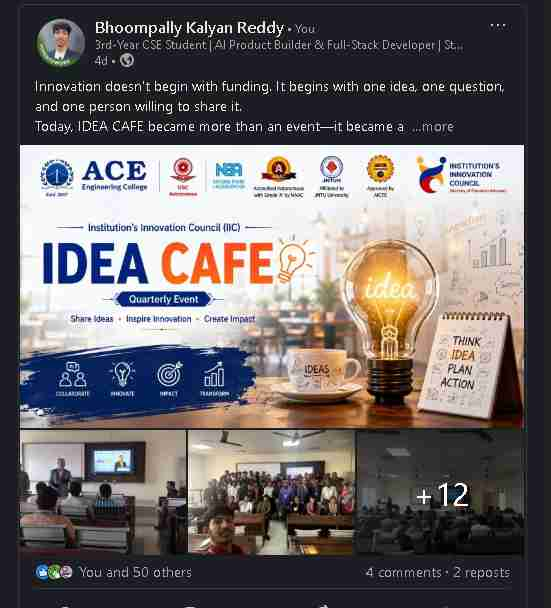
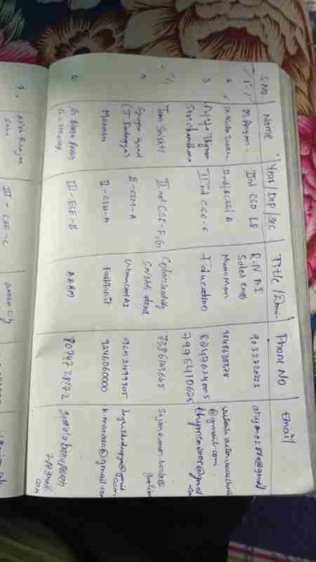
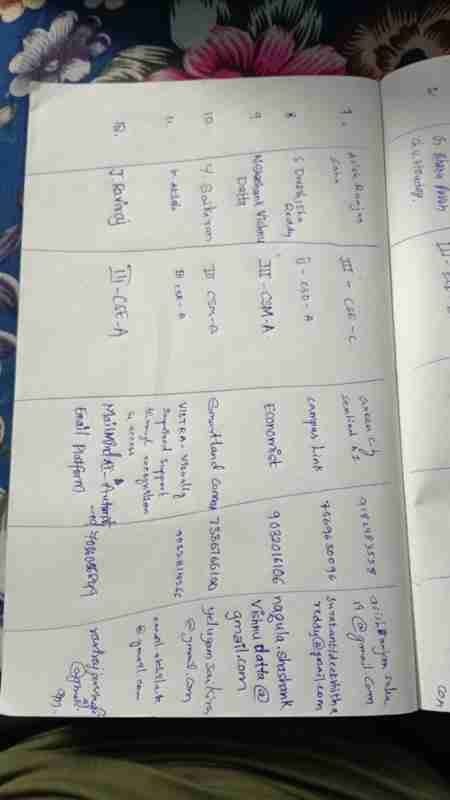

  
  

  <h1 style="margin: 0; font-size: 28px; border-bottom: 2px solid #333; padding-bottom: 10px; display: inline-block;">IIC Activity Report: The Idea Cafe</h1>

---

### Session Details:
* **Title of the session:** IIC x ACE: The Idea Cafe Meeting
* **Date with Month & Year:** 25 July 2026
* **Duration (in hours):** 7 Hours (9:30 AM to 4:30 PM)
* **Mode:** Offline
* **Venue / Platform:** 2408 Presentation Hall, ACE Engineering College
* **Activity Category:** IIC Calendar Activity / Self Driven Activity
* **Objective of the Activity:** (a) The purpose of the activity was to provide a platform for students to pitch early-stage startup ideas in a professional environment. (b) It was organized to connect student innovators with faculty mentors and hardware experts to validate and refine their concepts for the Ministry of Education's YUKTI Portal.
* **Activity Led by:** ACE Engineering College Student Council
* **Theme:** Innovation

---

### Expert/Speaker Details:
* **Name:** Sudhakar Reddy N
* **Designation:** Principal
* **Organization/Institution:** ACE Engineering College (ACEEC)
* **Brief about Expert/Speaker:** The Principal, alongside the President of IIC & Vice Principal, **Dr. Murali Malijeddi**, delivered the opening keynote. They set the vision for campus entrepreneurship and encouraged students to focus on solving real-world problems. The event was driven and hosted by Student Convener **B. Kalyan Reddy**.

---

### Brief description of the Activity (150-200 words):
The Idea Cafe was a dynamic, 7-hour intensive ideation and mentorship event. The session began with an inspiring opening address by the Principal and Convener, emphasizing the importance of the Ministry of Education's YUKTI Portal and setting ground rules for professional conduct. The core of the event was structured across a full day, divided into extensive pitch rounds and deep-dive mentorship breakout sessions. 

During the morning session, registered students delivered "Raw Pitches" presenting their unrefined startup concepts. After a short break at 11:10 AM, the 51-member coordinator team grouped students with domain-specific faculty experts for a comprehensive "Fix-It" breakout session. Mentors helped students restructure their ideas using the "3-Sentence Rule" (Problem, Solution, Impact). Following a 1-hour lunch break (12:30 PM to 1:30 PM), the afternoon kicked off with intensive Q&A and further refinement. After a brief afternoon break from 2:15 PM to 2:30 PM, the event concluded with students delivering "Refined Pitches." These final presentations showcased massive improvements in clarity and market viability, successfully bridging the gap between student innovators and experienced faculty mentors.

---

### Participant details:
* **Total no. of Student participation:** 150+ (including 15+ student pitchers and 51 coordinators)
* **Total no. of Staff (Teaching/Non-teaching) participation:** 14+
* **Total no of External participation:** 0

---

### Key Highlights:
* **Rapid Pitching:** Students were challenged to present their raw ideas under a strict 3-minute time limit, simulating real investor pitches.
* **Domain-Specific Grouping:** The 51 IIC coordinators successfully matched students with faculty mentors based on specific technical domains (Hardware, Software, etc.).
* **The "Fix-It" Breakout:** Highly interactive mentorship breakout sessions resulted in immediate, visible improvements to the students' core business models.
* **Professional Transformation:** The contrast between the morning "Raw Pitches" and afternoon "Refined Pitches" clearly demonstrated the immense value of faculty mentorship.
* **High Engagement:** Strict event management (doors closing exactly at 9:35 AM) ensured a highly professional, focused, and distraction-free environment.

---

### Outcome of the activity:
Participants gained hands-on experience in structuring a business pitch using the "Problem, Solution, Impact" framework. Students left with validated, refined startup concepts ready to be pushed to the prototype phase and submitted to the national YUKTI Portal. Furthermore, the event successfully activated the faculty network as active mentors for student-led innovations, directly reflecting the KPI of increasing campus entrepreneurship engagement.

---

### Feedback / Reflection:
* **Participant 1:** "The 45-minute breakout session with the faculty completely changed how I look at my idea. I realized my initial problem statement was too vague, and the mentors helped me narrow it down to a specific target audience."
* **Participant 2:** "Pitching in front of the whole room was intimidating, but getting immediate, constructive feedback instead of just criticism was incredibly motivating. I am ready for the Prototype Bootcamp next."

---

### Organizing Team Members Details:
* **B. Kalyan Reddy** - Convener (Lead Organizer and Event Host)
* **Dr. Murali Malijeddi** - President, IIC & Vice Principal
* **IIC Coordinators (51 Total Members)** - Facilitated mentor-student groupings, managed timekeeping, and maintained event discipline.

  <b>Complete List of IIC Student Coordinators:</b>  
  

---

### Photographs/Screenshots:
<table style="width: 100%; border: none; text-align: center;">
  <tr style="page-break-inside: avoid;">
    <td style="width: 50%; padding: 10px; vertical-align: top;">
      <b>1. The Massive Group Photo</b>  
      
    </td>
    <td style="width: 50%; padding: 10px; vertical-align: top;">
      <b>2. Participant Pitching</b>  
      
    </td>
  </tr>
  <tr style="page-break-inside: avoid;">
    <td style="width: 50%; padding: 10px; vertical-align: top;">
      <b>3. Q&A Session</b>  
      
    </td>
    <td style="width: 50%; padding: 10px; vertical-align: top;">
      <b>4. Banner Photo</b>  
      
    </td>
  </tr>
</table>

---

### Media Coverage and Pre & Post Activity Social Media Post screenshot:
* **Pre-Activity Post (LinkedIn):** [View Pre-Activity Post Here](https://www.linkedin.com/posts/bhoompally-kalyanreddy_aceengineeringcollege-ideacafe-iic-activity-7485531565851197441-QESr)
* **Post-Activity Post (LinkedIn):** [View Post-Activity Post Here](https://www.linkedin.com/posts/bhoompally-kalyanreddy_institutioninnovationcouncil-iic-aceengineeringcollege-activity-7486782288039632896-qyxs)

<table style="width: 100%; border: none; text-align: center;">
  <tr style="page-break-inside: avoid;">
    <td style="width: 50%; padding: 10px; vertical-align: top;">
      <b>Pre-Activity Engagement</b>  
      
    </td>
    <td style="width: 50%; padding: 10px; vertical-align: top;">
      <b>Post-Activity Engagement</b>  
      
    </td>
  </tr>
</table>

---

### Attendance details:
**Proof of signed Attendance sheet**

<table style="width: 100%; border: none; text-align: center;">
  <tr style="page-break-inside: avoid;">
    <td style="width: 50%; padding: 10px; vertical-align: top;">
      
    </td>
    <td style="width: 50%; padding: 10px; vertical-align: top;">
      
    </td>
  </tr>
</table>
