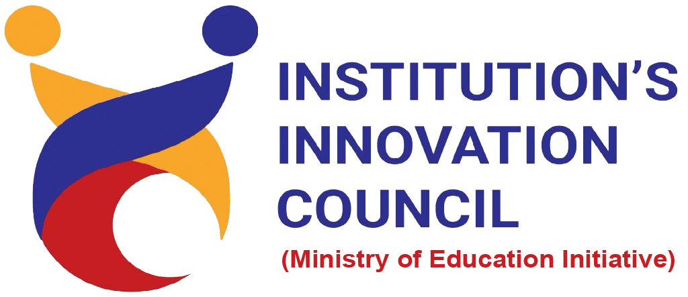
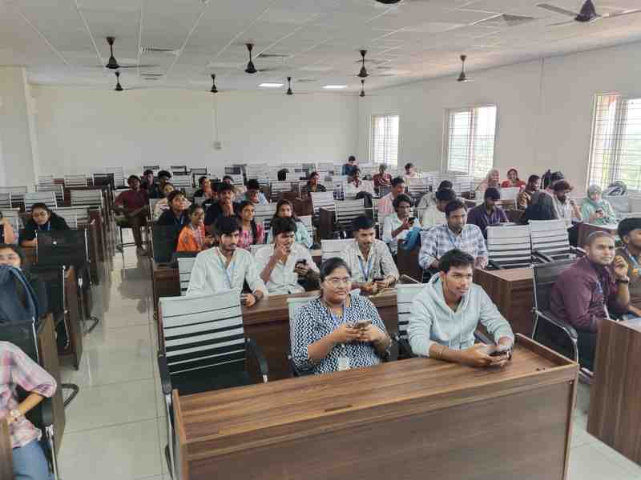
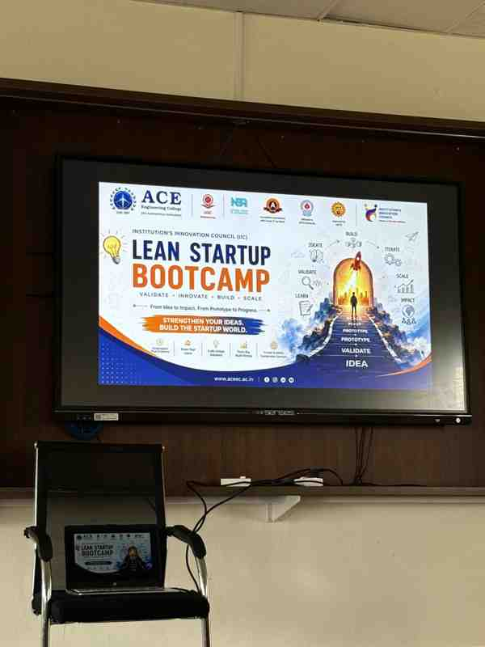
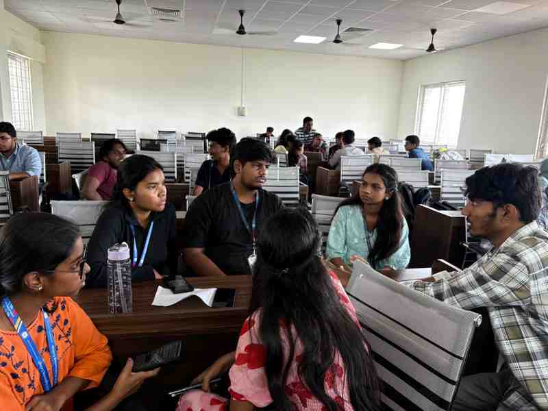
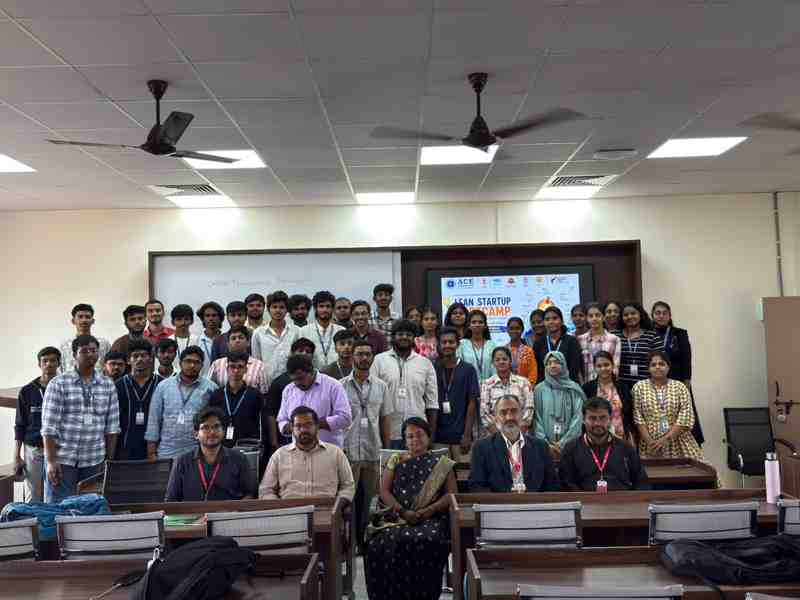

<table style="width: 100%; border: none;">
  <tr style="border: none;">
    <td style="width: 33%; text-align: left; border: none;">
      
    </td>
    <td style="width: 34%; text-align: center; border: none;">
    </td>
    <td style="width: 33%; text-align: right; border: none;">
      
    </td>
  </tr>
</table>

  <h2><u>IIC Activity Report</u></h2>

**Session Details:**
* **Title of the session:** Session on "Lean Start-up & Minimum Viable Product/Business" Boot Camp
* **Date with Month & Year:** 1 August 2026
* **Duration (in hours):** 6 Hours
* **Mode:** Offline
* **Venue / Platform:** Discussion Room 2408-2409, ACE Engineering College
* **Activity Category:** IIC Calendar Activity (Quarter IV)

**Objective of the Activity:** 
To guide student innovators through the Lean Startup methodology, focusing on rapid prototyping, customer validation, and launching with minimal resources. The bootcamp was organized to bridge the gap between abstract ideas and actionable Minimum Viable Products (MVPs).

**Activity Led by:** Student Council (Institution's Innovation Council)
**Theme:** Handholding and Capacity Development

**Expert/Speaker Details:**
* **Name:** Dr. Murali Malijeddi
* **Designation:** Vice Principal & Dean of Skill Development
* **Organization:** ACE Engineering College
* **Brief about Expert:** Dr. Malijeddi is an experienced academic leader and innovation evangelist who mentors student startups on scalable business models and market fit.

**Brief description of the Activity (150-200 words):**
The Lean Start-up Bootcamp began with an interactive session on the core principles of building a Minimum Viable Product (MVP). Dr. Murali Malijeddi explained how startups often fail by over-engineering products without validating customer needs. He introduced the "Build-Measure-Learn" feedback loop, demonstrating how students can test their assumptions quickly and cheaply. 

During the session, students were tasked with mapping out their MVPs for ideas they had previously brainstormed. Key topics covered included identifying the core value proposition, conducting user interviews, and pivoting based on feedback. The session concluded with a hands-on ideation exercise where teams presented their MVP roadmaps and received direct, actionable feedback from the mentors and their peers.

**Participant details:**
* **Total no. of Student participation:** 34 Students (Participants & Coordinators)
* **Total no. of Staff participation:** 3 Faculty Members
* **Total no. of External participation:** 0

**Key Highlights:**
* Interactive deep dive into the "Build-Measure-Learn" Lean Startup loop.
* Hands-on workshop where teams mapped out their core value propositions.
* Live Q&A and MVP validation exercises with the Vice Principal.
* Collaborative environment fostering rapid prototyping and peer feedback.
* High engagement from both junior and senior student teams.

**Outcome of the activity:**
Participants successfully developed concrete MVP roadmaps for their startup ideas, learning how to validate their concepts with target users before investing heavily in development. This aligns with the IIC KPI of increasing the number of actionable student-led innovations on campus.

**Feedback / Reflection:**
* *"The bootcamp completely changed how our team approaches product development. We realized we were focusing on the wrong features!"* - Team Participant
* *"Dr. Murali's insights on customer validation were incredibly practical and exactly what we needed to hear."* - Student Coordinator

**Organizing Team Members Details:**
* **B. Kalyan Reddy:** Student Convener (Event Orchestration)
* **IIC Coordinators:** Operations, Logistics, and Registration Management

**Photographs/Screenshots:**

  

    
    
<i>Wide view of the Lean Startup Bootcamp session in progress.</i>

  

  

    
    
<i>Students mapping out their MVPs during the hands-on exercise.</i>

  

  

    
    
<i>Interactive discussion and validation of startup concepts.</i>

  

  

    
    
<i>Participant engagement and peer feedback session.</i>

  

**Media Coverage & Social Media Promotion:**
Internal circulars and WhatsApp group announcements were utilized to mobilize the specific startup teams and IIC coordinators for this focused capacity-building bootcamp. 

Additionally, the event saw excellent post-activity organic promotion on LinkedIn by the Student Convener and IIC Coordinators, highlighting the impact of the session.

**Social Media Links:**
* [LinkedIn Post 1 (Student Convener)](https://www.linkedin.com/posts/bhoompally-kalyanreddy_leadership-innovation-entrepreneurship-ugcPost-7489298138504105984-cZSI)
* [LinkedIn Post 2 (IIC Coordinator)](https://www.linkedin.com/posts/satvendra-giri-nihal-badam_iic-leanstartup-startupcoordinator-ugcPost-7489539894403530752-HNde)
* [LinkedIn Post 3 (IIC Coordinator)](https://www.linkedin.com/posts/naga-srikar-mandalaparthi-1b70ba380_leanstartup-innovation-entrepreneurship-ugcPost-7489511349337673728-cxQJ)

**Attendance details:** Proof of signed Attendance sheet is attached as a separate PDF document alongside this report for submission.
